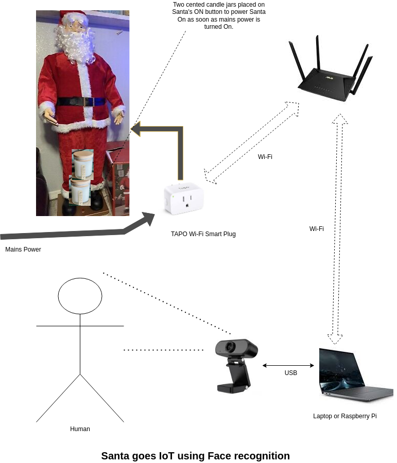

IoT Santa Claus
=======

## Santa Claus automation for my niece by face recognition
During a visit to the U.S. over Christmas to see a friend, we embarked on a delightful project to bring joy to his daughter. We automated a life-sized Santa Claus in his living room, complete with facial recognition, creating a magical and unforgettable experience.

### Video
[](https://youtu.be/jBM-frhHqko?si=ux92rnXBP_t_6cFA)

### Diagram


### Blog
[Santa Claus goes IoT](https://www.tweaklogic.com/santa-claus-goes-iot/)

### Prerequisites
1. PC/Laptop with network connection
OR
2. Raspberry Pi with monitor or touchscreen display (assuming default user **pi**)
3. TAPO Wi-Fi Smart plug: https://www.tapo.com/au/product/smart-plug/
4. Webcam

### TAPO Smart Plug
TP-Link TAPO Smart plugs are available off the shelf in Australia at Bunnings and Best Buy in the USA.
1. Install the TAPO app on your smartphone
2. Create user account and note down the credentials
3. Make sure you can operate the Smart Plug from your smartphone
4. Optionally go to device setting on your TAPO app and note down the IP address of the Smart Plug  

### Software Installation
1. Standard Ubuntu installation on any laptop or PC. Tested on Ubuntu 24.04.1 LTS
2. Raspberry Pi OS for Raspberry Pi. Tested on Bookworm 64 bit.
3. Clone this repository on your Raspberry Pi.
```
pi@raspberrypi:~ $ pwd
/home/pi
git clone https://github.com/tweaklogic/iot_santa_claus
cd /home/pi/iot_santa_claus/
```
4. Install the dependencies (dlib installation will take nearly an hour):
```
cd /home/pi/iot_santa_claus/
./iot_santa_claus-dependencies-install.sh
```
5. Discover your connected TAPO plug on your local network and note down the IP address
```
cd /home/pi/iot_santa_claus/
source python3-venv/bin/activate
kasa discover

Discovering devices on 255.255.255.255 for 10 seconds
== Authentication failed for device ==
	== Discovery Result ==
	Device Type:        SMART.TAPOPLUG
	Device Model:       P110(AU)
	IP:                 192.168.XXX.YYY
	MAC:                FF-FF-FF-FF-FF-FF
	Device Id (hash):   bbbbbbbbbbbbbbbbbbbbbbbbbbbbbbbb
	Owner (hash):       ffffffffffffffffffffffffffffffff
	Supports IOT Cloud: True
	OBD Src:            tplink
	Encrypt Type:       KLAP
	HTTP Port:          80
	Login version:      2
```
6. Open ***iot_santa_claus.py*** with your favorite editor and supply your TAPO ***IP address***, ***username*** and ***password***
7. Copy the desktop shortcuts to ~/Desktop
```
cd /home/pi/iot_santa_claus/
cp Capture.desktop ~/Desktop/
cp Santa.desktop ~/Desktop/
```
8. Right click on the desktop shortcuts and make them executable.

### Operation

#### Training faces
1. Double click the **Santa Capture** icon
OR
2. Execute the below command from terminal
Unfortunately, as of writing, a keyboard connection to the Pi is required for this step
```
cd /home/pi/iot_santa_claus/
./run_iot_santa_claus.sh add
```
Please wait till you get a dialog box stating ***Training Complete***
Click ***OK*** to complete step.

#### Starting the program
1. Double click the **IoT Santa Claus** icon
OR
2. Execute the below command form terminal
```
cd /home/pi/iot_santa_claus/
./run_iot_santa_claus.sh
```
#### Exiting the program
1. Mouse click and release on the screen or touch and release on a touchscreen
OR
2. Ctrl-C from terminal

#### References
TAPO control:
https://github.com/python-kasa/python-kasa

Face detection:
https://pypi.org/project/face-recognition/

Touchscreen events:
https://python-evdev.readthedocs.io/en/latest/

#### TODO
A keyboard attachment is required on the Raspberry Pi touchscreen for supplying the name during Capture routine. Onscreen keyboard is not working for some reason, have to fix it.

A C++ implementation will make the application run faster.

Support more IoT home automation devices.
